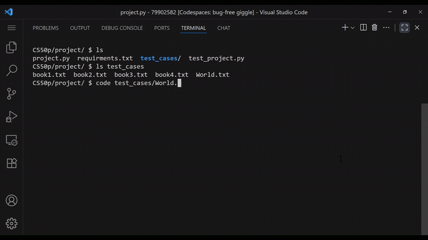

# Audiofy
#### [Watch Video Demo On Youtube](https://youtu.be/jBPI25KvD6U)



#### Short Description:
This is Audiofy, a command line program for converting books to audiobooks using Microsoft's Edge-TTS library.

---

## Table of Contents
- [Overview](#overview)
- [Features](#features)
- [Project Structure](#project-structure)
- [Installation](#installation)
- [Usage](#usage)
- [Command-Line Interaction](#command-line-interaction)
- [Files & Function Breakdown](#files--function-breakdown)
- [Design Decisions](#design-decisions)
- [Error Handling & Edge Cases](#error-handling--edge-cases)
- [Dependencies](#dependencies)
- [Testing](#testing)
- [Performance Considerations](#performance-considerations)
- [Limitations](#limitations)
- [Future Improvements](#future-improvements)
- [Acknowledgements](#acknowledgements)

---

## Overview
Audiofy is a command line program and you can run it on almost any text formatted book and it will convert that book to an audiobook and it will store that audiobook in a folder with the same name inside which there is an audio file per chapter.
The core functionality of this program is handled by two functions; load_file() and speechify().
- load_file() takes as input the text file provided when project is run and and using regular expressions converts that text file into a list of dictionaries. one dictionary per chapter.
each dictionary has two key value pairs one for the title of the chapter and one for the content.
- speechify() takes the list generated by load_file and converts into and audiobook one audio file per chapter.
---

## Features
- Converts text files to audio
- Automatically detects chapter structure in books
- Doesn't convert the TOC and intro so that you can immediately start listening to the book.
- Lets users decide which voice they want to narrate their book.
- it automatically detects empty books and doesn't convert them.
- Creates a separate folder for each audiobook and saves chapters as individual MP3 files.
- Handles common errors such as missing files, empty books, invalid input formats, and duplicate folder names.
- Displays a progress bar while converting chapters to audio for real-time feedback.
- Supports default voices and fallback options if the chosen voice is unavailable.
- Designed with asynchronous processing (`asyncio`) for faster TTS conversion.
---

## Project Structure
```

project/
├── project.py            main Audiofy file containing all core and helper functions.
├── test_project.py       test file for testing that project.py works as expected.
├── README.md             Documentation.
├── requirements.txt       list of all dependencies.
└── test_cases            contains 5 books for testing the functionality of the project.
     ├── book1.txt        empty book.
     ├── book2.txt        contains a book with simple chapter structure.
     ├── book3.txt        contains a book with intro , toc and simple chapter structure.
     ├── book4.txt        contains a book with no structure.
     └── World.txt        the text format of around the world in 80 days.
````

Output :
running ```project.py test_cases/World.txt``` will result in a directory being created inside test_cases.
the folder structure displayed above stays the same except :
````
└── test_cases
     ├── book2.txt
     ├── book3.txt
     ├── book4.txt
     ├── World
     |     ├── CHAPTER I.mp3
     |     ├── CHAPTER II.mp3
     |     ├── ...
     |     └── CHAPTER XXXVII.mp3
     └── World.txt
````
---

## Installation

```bash

# install required packages
pip install -r requirements.txt
````

---

## Usage
```bash
python project.py book.txt
```
After running this command assuming `book.txt` exists in the root directory of `project.py` and isn't empty, first a directory will be created inside the same directory as the book you provided. If a directory with the same name as the book already exists, you will be prompted to insert a name for the audiobook directory. The name must be unique, otherwise you will be prompted again until you provide a unique one.

Then you will be prompted to insert the name of the voice you want to narrate your audiobook; you must provide the name of a voice that is available in [edge tts voices](https://gist.github.com/BettyJJ/17cbaa1de96235a7f5773b8690a20462).

If you don't provide a valid voice it will prompt you again until you do. You can also leave it blank and press enter, in which case it will use the default voice I provided.

After you provide a valid voice it will start converting the book you provided into an audiobook.

---

## Command-Line Interaction

* Startup command:

  ```bash
  python project.py book.txt
  ```
* Prompts:

  "What would you like to name the audiobook?"
  "What voice would you like to narrate your audiobook?"
* Typical output:

  ```text
  You chose en-US-GUYNeural to narrate your audiobook.
  Converting to Audio: 100%|████████████████████████| ...
  ```

---

## Files & Function Breakdown

### `project.py`

* `main()`
   ##### Purpose
    The `main` function coordinates the process of converting a text file into an audiobook by validating inputs, loading the book, and passing it through the conversion pipeline.

  ##### Inputs
    - `sys.argv`: command-line arguments containing the filename of the book.
    - A text file (e.g., `book.txt`) located in the root directory.

  ##### Outputs / side effects
  - An audiobook generated from the provided text file.

  ##### Flow
  1. Call `check_usage(sys.argv)` to ensure the program is run correctly.
    - Returns the book title.
  2. Pass the book title to `load_file`.
    - Converts the text file into a list of dictionaries( each dictionary a chapter).
  3. Pass the output of `load_file` to `speechify`.
    - Converts the list of text into an audiobook.

* `check_usage(args: list) -> str`

  ##### Validation Logic
    - Ensure the right number of command line arguments
    - Ensure the book provided has the right format (.txt)
    - Ensure the book provided exists in the path provided.
    - Ensure the book provided isn't empty.
    - Ensure a folder with the same name as book_title doesn't exist
      if it does prompt user for what they wanna call the audiobook
  ##### Return Value
    ``book_title : str``

  ##### Possible Exits
  - **Wrong number of arguments**
    > Usage: `project.py book.txt`

  - **Invalid book file (Empty / Nonexistent)**
    > The book you provided doesn't exist.

    > The book you provided is empty.

  - **Directory already exists**
    > A folder called `{book_title}` already exists.

---
* `load_file(filename: str) -> list`
  ##### Loading Logic
  1. First it tries to open the book
  2. then it reads the book to memory and stores the  entire book inside one big string
  3. using regular expressions it detects start of each chapter in the book
    - if it fails to detect chapters it returns the book as a string  (the result will be a single audio file for the entire book.)
  4. it constructs a list of dictionaries out of the detected chapter beginnings
    book = a list of chapters
    each chapter = a dictionary with 2 key value pairs
    ```
    chapter = {
      "title" : contains the title of each chapter (later used to name audio files)
      "content" : contains the content of the chapter (the content of each audio file)
    }
    ```
    - before looking for chapter beginnings if the book starts with TOC or intro it removes that because i wanted the audiobook to only contain all the chapters.
    - Corner Cases: before constructing the list it checks to make sure the book doesn't just contain some empty chapters
  5. Lastly it returns the constructed list

  ##### Input :
  ``"filepath/filename" : str``
  Name of the book file and it's path
  #### Output :
  Either
  1. ``[book_as_str] : list`` : a list containing the entire book as one big string if no chapters are detected.

  OR

  2. ``book_chapters : list``  : Book as a list of dictionaries
  e.g:
  ```
  book_chapters = [
    {
      "title" : "CHAPTER I",
      "content" : "..."
    },
    {
      "title" : "CHAPTER II",
      "content" : "..."
    },
    ...,
    {
      "title" : "CHAPTER XXXVII",
      "content" : "..."
    }

  ]
  ```

---
* `speechify(book: list, book_title: str)`
  ##### Logic
    1. First we make a call to a helper function ``mk_audiobook_dir`` that tries to create a directory where we're going to store all the audio files. and catches any possible errors that might occur in that process.
    2. Then we make a call to another helper function ``get_voice`` that prompts the user for the voice they wanna use to narrate the audiobook and makes sure they provide a valid voice.
    prints a confirmation message indicating what voice they've chosen.
    3. Convert book to audio using an asynchronous function and save to file:

    - if the book doesn't have chapter structure
      1. convert the entire book to one audio file
      2. call the create_path helper function to create a file name for the audio file
      passing in the book_title for doing so
      3. save the audio file in ``./audiobook_name/book_title.mp3``


    - if the book has chapter structure

      Repeat for each chapter in the book

        ``
        audio_chapter = edge_tts.Communicate(chapter["content"], voice)
        ``
        1. convert the content of the chapter to audio
        2. call the create_path helper function to create a file name for the audio file
        passing ine the chapter title
        3. save audio file in ``./audiobook_name/chapter_title.mp3``

        ``.`` is where the book.txt is located
  ##### Input:
  the output from load_file
    Either
    1. ``[book_as_str] : list`` : a list containing the entire book as one big string if no chapters are detected.

    OR

    2. ``book_chapters : list``  : Book as a list of dictionaries
    e.g:
    ```
    book_chapters = [
      {
        "title" : "CHAPTER I",
        "content" : "..."
      },
      {
        "title" : "CHAPTER II",
        "content" : "..."
      },
      ...,
      {
        "title" : "CHAPTER XXXVII",
        "content" : "..."
      }

    ]
    ```
    #### Output
    this function doesn't return anything.
    But it has side effects.
    which is creating directories and audio files.

* `async get_voice()`
    1. calls on an edge_tts method to list all the voices available in that library.
    2. prompts the user for the voice they want to narrate their audiobook.
    3. checks if they've provided a valid voice
      - if they don't provide a valid voice prompts again till they cooperate.
      - if they press enter without providing a voice it defaults to ``en-US-GuyNeural``.
    3. returns the chosen name
    ##### Input
    None
    ##### Output
    Voice Name as a string
* `mk_audiobook_dir(book_title: str)`
  ##### purpose
    tries to create a directory to store audio files.
  ##### Input
    ``book_title: str`` it uses book title to create a directory with the same name.
  ##### Output
  ``None``  doesn't have an output it has side effects which is the directory that gets created
  ##### Edge Cases:
    there are many things that can go wrong when your trying to create a directory.
    which is why I have used the try and except block here to try to catch whatever might go wrong.


* `create_path(path: str, file_name: str) -> str`
  ##### Input
    1. ``filename`` what we wanna name the audio file
    2. ``filepath`` where we wanna store the audio file
  ##### Output
    - ``filepath/filename.mp3``   which will be passed to file.save
  ##### Purpose
    This function was created to avoid repeating the same path-construction code multiple times inside the `speechify` function.
    By isolating this simple task into its own function, the core functionality of `speechify` remains cleaner and easier to read.

---

## Design Decisions

The library that handles the core functionality of my project is ``edge-tts``.
I actually coded the speechify function using multiple libraries before I came across this library.
1. I started my project by using ``pyttsx3`` which I was introduced to in the last lecture of the course.

When I was trying to use pyttsx3 to convert a book into an audiobook, I ran into so many problems. I spent weeks trying to make it work on Linux; installing audio drivers, adjusting pitch and volume, trying different voices, even attempting to make it use my Windows drivers; but nothing helped. The voices always sounded robotic, and the library just wouldn’t behave reliably. Despite trying everything, I couldn’t fix it. That’s why I eventually moved on to using a different library for text-to-speech.


2. After some googling I found out that google has text to speech API that I could potentially use. which was actually very easy to use to my relief but that also ended up to be a dead end because Google Limits the number of calls you can make to the API at any given interval.
Which meant I couldn't make that work because in order to convert a big book to audio I needed to make multiple calls to the API in the span of just a few minutes.

3. After loads of googling I came across ``edge-tts`` which had a bit of a learning curve because the optimal way to use it is to define asynchronous functions; and although this was discussed in the last lecture a little bit I wasn't entirely comfortable with coding an asynchronous function yet so I had to spent some time looking at code examples on their documentation pages to figure out how to use it.

---

## Error Handling & Edge Cases

- **Non-`.txt` input file**: program exits with message
  `"Usage: project.py book.txt"`

- **Missing file**: program exits with message
  `"The Book you provided doesn't exist."`

- **Empty file**: program exits with message
  `"The Book you provided is empty."`

- **Existing audiobook directory**: prompts user again for a directory name

- **Permission errors / OS errors** while creating audiobook directory: program exits with message
  `"Directory creation failed error"`

- **Unavailable voice / invalid input** prompts user again and again till they provide a valid voice

- **No chapter structure detected** the book is converted into audiobook in one audio file containing the entire book.

---

## Dependencies

- **Python**: 3.8+ (async/await support required)

- **Packages**:
  - `edge-tts` – for text-to-speech conversion
  - `tqdm` – for progress bars
  - `pytest` - Only required for testing, not running the program.

- **Standard Library (no installation needed)**:
  - `asyncio`
  - `sys`
  - `re`
  - `os`

---

## Testing

```bash
# example test command
pytest test_project.py
```

  In this project I wrote tests for 3 of my functions: check_usage, load_file, create_path

  1. ``check_usage``

        For testing my check_usage function since it takes as input sys.argv as a list I tried passing different possible versions of that list to it.
        I tested that each of the cases below was treated as expected.
      - Incorrect number of command line args
      - book with incorrect format
      - nonexistent book
      - empty book
      - correct usage returns book title

  2. ``load_file``
        For testing load file I created sample test_case books with different structures each of these test cases represent a certain formatted book that you might come across in the real world.
        And then I check that each input corresponds to the expected output.
        For each of the test cases listed below load_file must be able to separate the book into chapters and construct the corresponding list of dictionaries.
        Test Cases:
      - **book2.txt** a book with simple chapter structure
      - **book3.txt** a book with intro and TOC
      - **book4.txt** a book with no chapter structure   -> must be turned into one big string


## Limitations

- Currently, the program only supports .txt format.


---

## Future Improvements

* Command Line programs are only used by developers and the target audience for my program isn't just developers I better design a different Interface for it. a website would be great.
* Instead of the user having to type the voice name they could choose from a dropdown selector.
* Instead of the user having to provide the ebook they could also have the option of going through ebooks that are already available and convert those if they want.
the ebooks could be listed using an API to an open source library like [Project Gutenberg](https://www.gutenberg.org/)
* the audiobooks that have been converted before by other users can be stored so that new users can save time if they want the already existing audiobooks
* I think I could look for better text to speech libraries especially if there is one powered by AI  it would sound better.

#### Testing Improvements
I think the biggest flaw my program has are the tests they are not exactly reliable and I don't think that's how tests in the real world are written.
I would like to learn more about mocks and fixtures in pytest because I think that my tests have a big potential fo improvement.
I also need to learn how to test asynchronous functions/ processes.

---

## Acknowledgements

Resources, and libraries:

* `` edge_tts``
  the library I used to convert text to speech.
* ``asyncio``
  I used this to help me convert text to audio.
  converting an entire book to audio takes a long time and using asyncio helps you make the conversion asynchronous which means it does the conversion chunk by chunk not all at once which is a great way to make sth that takes a long time run faster.

* ``tqdm``
  the library I used to print a progress bar in the terminal while the book to audiobook conversion was in progress to indicate that everything was going as expected.
  Some large books took a long time to convert, not having a progress bar made it hard to figure out whether everything was fine or something unexpected had gone wrong.

---

## Author : **Negin Jahedi**
